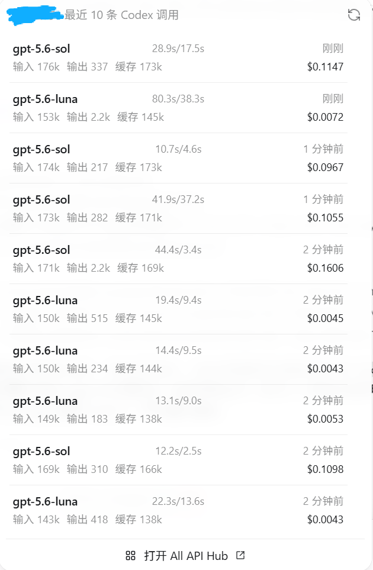
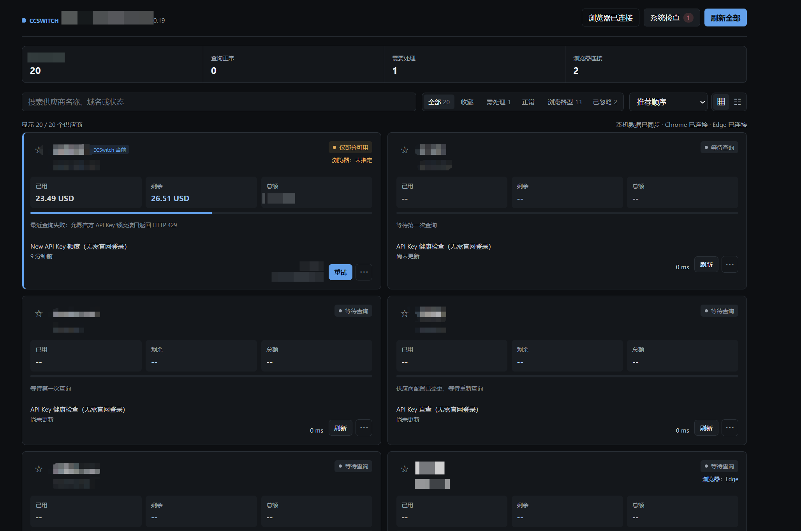

# Codex CCSwitch Usage

一个 Windows/macOS 本地扩展：读取 CCSwitch 的 Codex 供应商信息，并把用量嵌入 Codex 输入栏。当前以 v3 Balance Hub 为主。

## 先看效果

<p align="center">
  
</p>

<table>
  <tr>
    <td></td>
    <td></td>
  </tr>
  <tr>
    <td></td>
    <td></td>
  </tr>
</table>

完整图片索引见 [余额插件使用效果图](./docs/BALANCE_PLUGIN_SCREENSHOTS.md)。

## 选择版本

| 版本 | 分支 | 适用场景 | 用量来源 | All API Hub | 浏览器伴侣 |
|---|---|---|---|---|---|
| [v3.0.0](./docs/V3.md) | `v3` | 统一查看和管理全部 Codex / GPT 供应商 | v3 内置适配器与统一 Balance Hub | 支持 | 支持 |

- 使用 v3：阅读 [v3 用户文档](./docs/V3.md)；开发与热更新流程见 [v3 开发文档](./DEVELOPMENT.md)。
- 旧版基本弃用，仅保留历史兼容；资料见 [旧版文档](./docs/V1.md)。
- 隐私、安全边界与漏洞报告方式见 [隐私与安全政策](./SECURITY.md)。

## 分支策略

- `v3`：当前 Balance Hub 版本的发布与维护分支。
- `main`：仓库默认分支，保留上一稳定版本内容。

源码模式支持 Windows 和 macOS；正式 Release 提供 Authenticode 签名的 Windows 安装包，以及 Developer ID 签名并经 Apple 公证的 Apple Silicon / Intel `.app` 压缩包。项目保持 CCSwitch 数据库只读，不修改 Codex 的 `app.asar`、MSIX 文件或 Codex 配置。

## macOS 源码运行

macOS 支持源码模式；普通用户可从 v3 GitHub Release 下载对应架构且已公证的 `.app` 压缩包。源码运行要求 Node.js 22 或更高版本、已安装 CCSwitch，并让 Codex 以随机的本机回环 CDP 端口启动。若应用名为 `Codex`，可以使用：

```bash
CDP_PORT=$((49152 + RANDOM % 16384))
open -a "Codex" --args \
  --remote-debugging-address=127.0.0.1 \
  --remote-debugging-port="$CDP_PORT" \
  --remote-allow-origins="http://127.0.0.1:$CDP_PORT" \
  --no-first-run
```

在项目根目录执行：

```bash
npm run stop-host:mac -- --install-root "$PWD" --all-instances
npm run launch:mac -- --install-root "$PWD"
```

启动入口会从已运行的 Codex 根进程自动发现端口，不会关闭或重启 Codex；如果 macOS 上的进程名不是 `Codex` 或无法自动识别根进程，可先确认 CDP 已就绪，再追加 `--codex-pid <PID>`。实际端口写入权限为当前用户专有的 `runtime/cdp-port`。CCSwitch 数据库默认读取 `~/.cc-switch/cc-switch.db`，官方会话默认读取 `~/.codex`。
